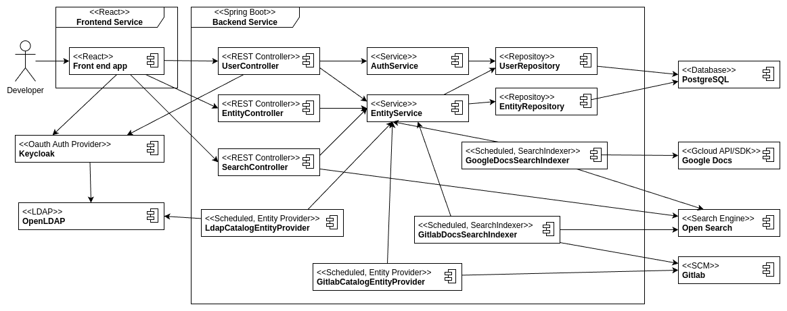
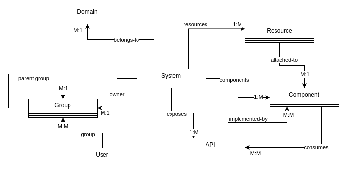

# Control-Booth

The control-boot is a simple (and incomplete) experiment to see how to build
an [IDP](https://internaldeveloperplatform.org/what-is-an-internal-developer-platform/) like [Backstage](https://demo.backstage.io/catalog?filters%5Bkind%5D=component&filters%5Blifecycles%5D=production&filters%5Blifecycles%5D=experimental&filters%5Buser%5D=all) with  a [React](https://react.dev/) Front-end
and a Java Back-end based on [Spring Boot](https://spring.io/projects/spring-boot).

The goal of the UI is to be a no-nonsense, effective and compact
(Backstage has to much space in it IMHO).

The focus of control-booth is on BACKEND developers exposing services/information
to other developers, so the front-end scode/setup might change moving forward if
I find a better/simpler way to build a responsive UI.

We use plain Javascript and HTML for the UI components to keep the code as simple 
and minimize library/framework clashes.


[About this project](./src/main/resources/about.md)

### Limitations

At the moment not much is implemented, but what works:

- Authentication via Keycloak backed by OpenLDAP
- [LdapCatalogEntityProvider](src/main/java/com/pehrs/controlbooth/catalog/LdapCatalogEntityProvider.java) scans LDAP and creates user and group entities.
- Simple Catalog page that list the entities in the database.
- Profile page the shows the user details (including the jpegPhoto if it exists in LDAP)
- Support for dark/light mode in the UI.
- About page.

## Architecture



### Catalog Entities



## Plan/TODO

This project is incomplete and there are areas of an IDP that I would like to explore:

- Refactor the code to use the [Hexagonal Architecture](https://en.wikipedia.org/wiki/Hexagonal_architecture_(software)) pattern.
- GitLab/GIT
    - Create a catalog entity provider that scans a Gitlab instance for
      catalog-info.yaml, parses them and creates the appropriate entities.
- Search - Integrate Open Search or Vespa (Open source search engines)
    - Document Search Indexer - Index documentation from GIT repos.
        - Should this work like Backstage and pick up MD files and render them to a bucket
          or should we just pick up the MD/HTML text bodies and index them with references
          back to the source (Gitlab repo)?
        - Plugins for
            - Google docs
            - Confluence
            - Websites (webcrawl)
- Plugins/extensions
    - How should people use this IDP?
        - Backend? - Package this repo as a spring boot lib?
        - Frontend? - Package the reusable parts as lib?
- Golden Path (Templating)
    - Is there a better way to orchestrate and generate/maintain templates/golden-paths
        - Use proper template solution to separate the
          development of templates from the orchestration/workflow.
            - [cookiecutter](https://github.com/cookiecutter/cookiecutter)
            - [copier](https://copier.readthedocs.io/en/stable/)
        - Simple approval workflows
            - Roles/groups allowed to initiate
            - Roles/groups allowed to approve
            - Backend would be just a simple REST endpoint with predefined POST JSON payload
- Resource Monitoring (Plugins)
    - K8s workload monitoring
    - Google Resources
    - AWS Resources
    - Grafana
    - Prometheus
- Alerting/On-Call
    - Open source solution
        - https://github.com/dfir-iris/iris-web and https://github.com/linkedin/oncall
- Notifications
    - Email/SMTP
    - https://matrix.org/ and https://matrix.org/ecosystem/clients/
- Figure out how to make Intellij to run maven targets on build.
  It's annoying that build steps are missed when building and running this project only in Intellij.

## Build

The application can be built using the following command:

```
# Make sure the assets are downloaded for the frontend app
./scripts/app-get-assets.sh

mvnw clean package
```

If required, a Docker image can be created with the Spring Boot plugin. Add
`SPRING_PROFILES_ACTIVE=production` as environment variable when running the container.

```
mvnw spring-boot:build-image -Dspring-boot.build-image.imageName=com.pehrs/control-booth
```

## Run

### DNS/Hostname configuration

Before you start you need to setup a few hostnames that resolves to your developer host.
The default configuration assumes two hosts

- control-booth.org - The frontend/backend service
- auth.nsa2.com - Authentication provider (keycloak)

One way of configuring this (if you do not have control over you DNS service) is to
do a local override in your `/etc/hosts` file:

```config
127.0.0.1 auth.nsa2.com
127.0.0.1 control-booth.org
```

I was not able to make the above `/etc/hosts` override to work in
my local setup and had to add some overrides in my DNS server instead.

### Start the services

```shell

# Start needed services
docker-compose -f docker-compose.yml up -d

# Start the backend service
mvn spring-boot:run

# Make sure the assets are downloaded for the frontend app
./scripts/app-get-assets.sh

# Start the front end (will open localhost:3000)
cd app
npm install
npm run start
```

Services:

| endpoint                                                | description                        |
|---------------------------------------------------------|------------------------------------|
| http://localhost:3030<br/>http://control-booth.org:3030 | Control Booth Frontend application |
| http://localhost:8080                                   | Control Booth Backend application  |
| http://localhost:5433                                   | Control Booth PostgreSQL database  |
| http://localhost:9000<br/>http://auth.nsa2.com:9000     | Keycloak                           |
| http://localhost:8081                                   | phpldapadmin                       |
| http://localhost:389                                    | OpenLDAP                           |

Once everything is up and running then you should be 
able to login with user "matti.pehrs" with the password "pass".


### WIP --- Start production backend:

```
java -Dspring.profiles.active=production -jar ./target/control-booth-0.0.1-SNAPSHOT.jar
```

